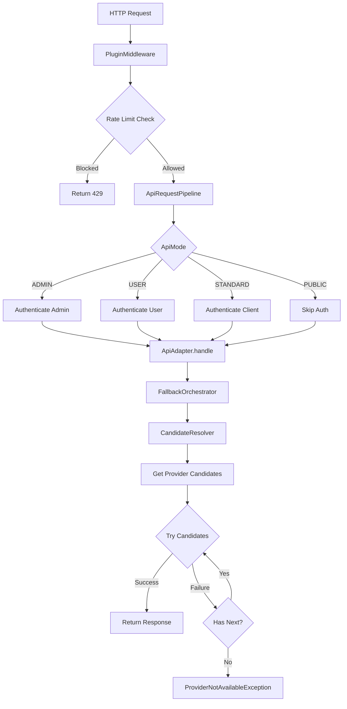

# Aether 项目分析报告

> 分析日期: 2026-01-11
> 项目版本: v4.0.0
> 分析范围: 全项目架构与核心功能

---

## 目录

1. [项目概览](#1-项目概览)
2. [技术栈](#2-技术栈)
3. [项目架构](#3-项目架构)
4. [核心功能模块](#4-核心功能模块)
5. [数据库设计](#5-数据库设计)
6. [代码质量](#6-代码质量)
7. [入口点与关键流程](#7-入口点与关键流程)
8. [部署与配置](#8-部署与配置)
9. [架构亮点](#9-架构亮点)
10. [总结](#10-总结)

---

## 1. 项目概览

**Aether** 是一个开源的 AI API 网关，提供多租户管理、智能负载均衡、成本配额控制和健康监控能力。通过统一的 API 入口，可以无缝对接 Claude、OpenAI、Gemini 等主流 AI 服务及其 CLI 工具。

### 核心特性

- **多 API 格式支持**: Claude / OpenAI / Gemini 及其 CLI 工具
- **多租户用户管理**: 基于 RBAC 的权限控制与配额管理
- **智能故障转移**: 预取策略 + 优先级排序的自动故障转移
- **缓存亲和性**: 创新的缓存优化策略，提升 1H 缓存命中率
- **灵活计费系统**: 支持多种计费模式与配额管理
- **完整监控体系**: 链路追踪、性能监控、审计日志
- **插件化架构**: 高度可扩展的插件系统

### 项目定位

Aether 作为自托管的 AI API 网关，主要服务于以下场景：

- 团队内部 AI 能力统一管理与分发
- 多租户 AI 服务的隔离与控制
- AI 成本控制与配额管理
- AI 模型请求的高可用与负载均衡

---

## 2. 技术栈

### 2.1 后端技术栈

| 类别 | 技术 | 版本要求 | 用途 |
|------|------|----------|------|
| **Web 框架** | FastAPI | >= 0.115.11 | 高性能异步 Web 框架 |
| **服务器** | Uvicorn / Gunicorn | >= 0.34.0 / >= 23.0.0 | ASGI 服务器 |
| **数据库 ORM** | SQLAlchemy | >= 2.0.43 | Python SQL 工具包 |
| **数据库迁移** | Alembic | >= 1.16.5 | 数据库版本控制 |
| **数据库驱动** | asyncpg, aiosqlite, psycopg2-binary | - | 异步数据库驱动 |
| **缓存/队列** | Redis | >= 5.0.0 | 分布式缓存与消息队列 |
| **认证加密** | bcrypt, PyJWT, cryptography | - | 密码哈希与 JWT |
| **HTTP 客户端** | httpx[socks], aiohttp | >= 0.28.1 / >= 3.12.15 | 异步 HTTP 客户端 |
| **日志** | loguru | >= 0.7.3 | 结构化日志 |
| **任务调度** | APScheduler | >= 3.10.0 | 定时任务调度 |
| **监控** | prometheus-client | >= 0.20.0 | Prometheus 指标导出 |
| **LDAP** | ldap3 | >= 2.9.1 | LDAP 认证支持 |
| **Token 计算** | tiktoken | >= 0.5.0 | OpenAI Token 计算 |

**开发工具**:
- pytest: 测试框架
- black: 代码格式化
- isort: 导入排序
- mypy: 类型检查
- hatchling + hatch-vcs: 构建与版本管理

### 2.2 前端技术栈

| 类别 | 技术 | 版本 | 用途 |
|------|------|------|------|
| **框架** | Vue | 3.5.18 | 渐进式 JavaScript 框架 |
| **语言** | TypeScript | ~5.8.3 | 类型安全的 JavaScript |
| **构建工具** | Vite | 7.1.2 | 下一代前端构建工具 |
| **状态管理** | Pinia | 3.0.3 | Vue 官方状态管理库 |
| **路由** | Vue Router | 4.5.1 | Vue 官方路由 |
| **UI 组件** | radix-vue | 1.9.17 | 无样式 Vue 组件库 |
| **图标** | lucide-vue-next | 0.544.0 | 图标库 |
| **图表** | Chart.js + vue-chartjs | 4.5.0 / 5.3.2 | 图表可视化 |
| **样式** | Tailwind CSS | 3.4.17 | 原子化 CSS 框架 |
| **Markdown** | marked + dompurify | 16.0.0 / 3.3.0 | Markdown 渲染与 XSS 防护 |
| **3D 渲染** | three.js | 0.180.0 | 3D 图形库（Logo 动画） |
| **工具库** | @vueuse/core, axios, date-fns | - | 实用工具集合 |

**开发工具**:
- vitest: 单元测试框架
- eslint: 代码检查
- typescript-eslint: TypeScript ESLint
- vue-tsc: Vue TypeScript 类型检查

### 2.3 基础设施

| 服务 | 技术 | 版本 | 用途 |
|------|------|------|------|
| **数据库** | PostgreSQL | 15 | 生产环境主数据库 |
| **缓存** | Redis | 7-alpine | 分布式缓存与消息队列 |
| **容器化** | Docker / Docker Compose | - | 容器化部署 |
| **反向代理** | Nginx (可选) | - | 生产环境反向代理 |

---

## 3. 项目架构

### 3.1 整体架构图

```
┌─────────────────────────────────────────────────────────────┐
│                      Client Layer                           │
│  (Claude Code, OpenAI CLI, Gemini CLI, Web Dashboard)      │
└─────────────────────────────────────────────────────────────┘
                              ↓
┌─────────────────────────────────────────────────────────────┐
│                   API Gateway Layer                         │
│  ┌──────────────┬──────────────┬──────────────┬─────────┐  │
│  │   Public API │  Admin API   │  User API    │ Auth API│  │
│  │  /v1/*       │  /api/admin/*│ /api/users/me│ /api/auth│  │
│  └──────────────┴──────────────┴──────────────┴─────────┘  │
│         ↓                                                  │
│  ┌─────────────────────────────────────────────────────┐   │
│  │          ApiRequestPipeline (Middleware)            │   │
│  │  - Authentication (JWT/API Key)                     │   │
│  │  - Authorization (RBAC)                             │   │
│  │  - Rate Limiting (Sliding Window)                   │   │
│  │  - Audit Logging                                    │   │
│  └─────────────────────────────────────────────────────┘   │
└─────────────────────────────────────────────────────────────┘
                              ↓
┌─────────────────────────────────────────────────────────────┐
│                   Service Layer                             │
│  ┌───────────────────┬───────────────────────────────────┐ │
│  │ Orchestration     │ Business Services                 │ │
│  │ - FallbackOrchestrator  │ - UsageService               │ │
│  │ - CandidateResolver     │ - BillingService            │ │
│  │ - RequestDispatcher     │ - UserCacheService          │ │
│  │ - ErrorClassifier       │ - SystemConfigService       │ │
│  └───────────────────┴───────────────────────────────────┘ │
│  ┌─────────────────────────────────────────────────────┐   │
│  │         Plugin System (Extensible)                  │   │
│  │  - Rate Limit Plugins  - Cache Plugins              │   │
│  │  - Auth Plugins        - Monitor Plugins            │   │
│  └─────────────────────────────────────────────────────┘   │
└─────────────────────────────────────────────────────────────┘
                              ↓
┌─────────────────────────────────────────────────────────────┐
│                   Data Layer                                │
│  PostgreSQL │ Redis Cache │ HTTP Client Pool │ Providers   │
└─────────────────────────────────────────────────────────────┘
```

### 3.2 分层设计

#### API 层 (`src/api/`)

路由按功能域划分：

| 目录 | 路径前缀 | 用途 |
|------|----------|------|
| `public/` | `/v1/*` | 公开 API（兼容多格式） |
| `admin/` | `/api/admin/*` | 管理员端点 |
| `user_me/` | `/api/users/me` | 用户个人端点 |
| `auth/` | `/api/auth/*` | 认证相关 |
| `dashboard/` | `/api/dashboard` | 仪表盘数据 |
| `monitoring/` | `/api/monitoring` | 监控端点 |

**适配器模式** (`src/api/base/`):
- `ApiAdapter`: 所有 API 处理器的抽象基类
- `ApiRequestPipeline`: 统一的请求处理管道
- 支持 5 种模式：`STANDARD`, `ADMIN`, `USER`, `PUBLIC`, `MANAGEMENT`

#### 服务层 (`src/services/`)

**编排服务** (`orchestration/`):
- `FallbackOrchestrator`: 故障转移编排器（核心）
- `CandidateResolver`: 候选解析器
- `RequestDispatcher`: 请求分发器
- `ErrorClassifier`: 错误分类器

**业务服务**:
- `usage/`: 使用记录与配额管理
- `billing/`: 计费计算
- `cache/`: 缓存服务
- `rate_limit/`: 速率限制
- `user/`: 用户管理
- `auth/`: 认证服务
- `system/`: 系统配置

#### 数据层 (`src/models/`)

**数据库模型** (`database.py`):
- 核心实体：`User`, `ApiKey`, `Provider`, `ProviderAPIKey`
- 模型定义：`GlobalModel`, `Model`
- 使用记录：`Usage`, `RequestCandidate`, `RequestTrace`
- 统计数据：`StatsDaily`, `StatsDailyModel`
- 系统配置：`SystemConfig`, `Announcement`

**关系映射**:
- 使用 SQLAlchemy ORM
- 支持级联删除与软删除
- 完整的索引设计

#### 插件系统 (`src/plugins/`)

支持插件类型：
- `auth`: 认证插件
- `rate_limit`: 限流插件
- `cache`: 缓存插件
- `monitor`: 监控插件
- `token`: Token 处理插件
- `notification`: 通知插件
- `load_balancer`: 负载均衡插件

特性：
- 自动发现与注册机制
- 优先级排序与链式调用
- 版本兼容性检查

---

## 4. 核心功能模块

### 4.1 请求处理流程



**关键步骤**:

1. **插件中间件**: 限流检查、性能监控、数据库会话管理
2. **请求管道**: 根据模式进行认证/授权
3. **适配器处理**: 调用具体 API 格式的处理器
4. **故障转移编排**: 遍历候选 Provider，直到成功或全部失败

### 4.2 故障转移机制

**预取策略** (V2 - 预取优化):
- 启动时预先获取所有可用的 Provider/Endpoint/Key 组合
- 按优先级排序：`Provider.provider_priority` → `Key.internal_priority`
- 过滤条件：活跃状态、健康度、熔断器状态、模型支持、API 格式匹配
- 顺序遍历组合列表，每个组合只尝试一次
- 重试次数 = 实际可用组合数（无固定上限，避免过度重试）

**优势**:
- 可预测：执行路径明确
- 高效：一次性获取所有候选
- 公平：所有候选都有机会
- 资源友好：避免无效重试

### 4.3 多 API 格式支持

| 格式 | 端点前缀 | Handler | 特性 |
|------|----------|---------|------|
| **Claude** | `/v1/messages` | `src/api/handlers/claude.py` | Messages API, Token Count |
| **OpenAI** | `/v1/chat/completions` | `src/api/handlers/openai.py` | Chat Completions, Embeddings |
| **Gemini** | `/v1/messages` | `src/api/handlers/gemini.py` | Generate Content |
| **CLI** | 特定路径 | `src/api/handlers/cli/` | Claude Code, Codex, Gemini CLI |

**适配器特性**:
- 统一的错误处理
- 自动格式转换
- 一致的计费逻辑
- 完整的链路追踪

### 4.4 计费系统

**支持维度**:
- 输入/输出 Token 计费
- 缓存创建/读取计费
- 按次计费（Pay-per-request）
- 阶梯计费（Tiered pricing）

**计费模板**:
- `claude`: Claude 计费模板
- `openai`: OpenAI 计费模板
- `gemini`: Gemini 计费模板

**配额管理**:
- 用户级别配额 (`User.quota_usd`)
- Provider 月卡配额 (`Provider.monthly_quota_usd`)
- API Key 独立余额 (`ApiKey.balance_usd`)
- 定期自动重置（通过 `QuotaScheduler`）

### 4.5 缓存系统

**两层缓存架构**:
- **L1 本地缓存**: 内存 LRU 缓存 (3秒 TTL)
- **L2 分布式缓存**: Redis 缓存 (可配置 TTL)

**缓存亲和性** (Cache Affinity):
- 相同用户请求优先路由到相同 Provider Endpoint
- 提升 Claude 1H 缓存命中率
- 默认 TTL: 5 分钟（可配置）
- 实现方式：Redis Hash 记录用户 → Endpoint 映射

**预留机制**:
- 缓存用户可使用全部 RPM 槽位
- 新用户只能使用部分槽位（默认 70%）
- 保证缓存用户的请求优先

### 4.6 并发控制

**RPM 限制**:
- 基于 Redis 的滑动窗口算法
- 支持 Key 级别的 RPM 限制
- 自适应模式：动态调整限制（`rpm_limit = NULL`）

**并发槽位管理**:
- 基于 Redis 的分布式锁
- 防止单个 Key 过度并发
- 支持动态调整并发限制

**IP 限流**:
- 支持按 IP 地址的速率限制
- 白名单/黑名单机制
- 滑动窗口实现

---

## 5. 数据库设计

### 5.1 核心表结构

#### 用户与认证

| 表名 | 用途 | 关键字段 |
|------|------|----------|
| `users` | 用户表 | id, email, username, role, quota_usd, allowed_providers |
| `api_keys` | 用户 API 密钥 | id, user_id, key_hash, rate_limit, balance_used_usd |

#### Provider 管理

| 表名 | 用途 | 关键字段 |
|------|------|----------|
| `providers` | AI 提供商 | id, name, provider_priority, monthly_quota_usd |
| `provider_endpoints` | 提供商端点 | id, provider_id, api_format, base_url |
| `provider_api_keys` | 提供商密钥 | id, provider_id, endpoint_id, api_key_encrypted, rpm_limit |

#### 模型管理

| 表名 | 用途 | 关键字段 |
|------|------|----------|
| `global_models` | 全局模型定义 | id, name, family, default_prices |
| `models` | 提供商模型配置 | id, provider_id, global_model_id, provider_model_name |

#### 使用记录

| 表名 | 用途 | 关键字段 |
|------|------|----------|
| `usage` | 使用记录 | id, user_id, api_key_id, status_code, total_cost_usd |
| `request_candidates` | 请求候选记录 | request_id, candidate_index, status, latency_ms |
| `request_trace_attempts` | 请求追踪 | request_id, attempt_index, provider_id, timing |

#### 统计数据

| 表名 | 用途 | 关键字段 |
|------|------|----------|
| `stats_daily` | 每日统计 | user_id, date, total_requests, total_cost_usd |
| `stats_daily_model` | 模型每日统计 | user_id, model_id, date, total_tokens |

#### 系统配置

| 表名 | 用途 | 关键字段 |
|------|------|----------|
| `system_config` | 系统配置 | key, value, description |
| `announcements` | 公告系统 | title, content, priority |

### 5.2 关系映射

**核心关系**:
- User → ApiKey (1:N)
- User → Usage (1:N)
- Provider → ProviderEndpoint (1:N)
- ProviderEndpoint → ProviderAPIKey (1:N)
- Provider → Model (1:N)
- GlobalModel → Model (1:N)
- ApiKey → Usage (1:N)
- Request → RequestCandidate (1:N)

**级联策略**:
- `CASCADE`: 用户删除时删除其 API Keys
- `SET NULL`: 用户删除时保留 Usage 记录
- `SOFT DELETE`: 通过 `is_deleted` 标记

### 5.3 关键索引

**性能优化索引**:
- `users`: email (unique), username (unique)
- `api_keys`: key_hash (unique), user_id
- `usage`: user_id, created_at, api_key_id
- `request_candidates`: request_id, status, provider_id
- `provider_api_keys`: rpm_limit, supported_capabilities
- `stats_daily`: user_id, date

**复合索引**:
- `idx_request_candidates`: (request_id, candidate_index, retry_index)
- `idx_stats_user_daily`: (user_id, date) UNIQUE

---

## 6. 代码质量

### 6.1 代码规范

**Python 代码规范**:
- **行长度**: 100 字符
- **格式化工具**: black
- **导入排序**: isort (profile: black)
- **类型检查**: mypy (严格模式)
  - `disallow_untyped_defs = true`
  - `warn_return_any = true`
  - `warn_unused_configs = true`
- **文档字符串**: Google 风格

**TypeScript/Vue 代码规范**:
- **ESLint**: TypeScript ESLint + Vue ESLint
- **组件风格**: Composition API + `<script-setup>`
- **命名规范**:
  - 组件: PascalCase
  - 文件: kebab-case
  - 事件: camelCase
  - 常量: UPPER_SNAKE_CASE
- **类型安全**: 严格的 TypeScript 配置

### 6.2 测试覆盖

**后端测试** (`tests/`):
- **测试框架**: pytest + pytest-asyncio
- **覆盖率**: `--cov=src`
- **测试类别**:
  - 计费模块测试 (`tests/services/billing/`)
  - 认证服务测试 (`tests/services/test_auth.py`)
  - API Pipeline 测试 (`tests/api/test_pipeline.py`)
  - 使用服务测试 (`tests/services/test_usage_service.py`)

**前端测试**:
- **测试框架**: Vitest + jsdom
- **覆盖率报告**: JSON + HTML
- **测试脚本**:
  - `npm run test`: 运行测试
  - `npm run test:ui`: UI 模式
  - `npm run test:run`: 单次运行

### 6.3 文档

**API 文档**:
- Swagger UI (`/docs`): 交互式 API 文档
- ReDoc (`/redoc`): 参考文档
- OpenAPI 3.0 规范: `/openapi.json`

**设计文档**:
- `frontend/DESIGN_SYSTEM.md`: 前端设计系统
- `README.md`: 部署与使用指南
- `docs/Task/`: 任务计划文档
- `docs/migration/`: 数据库迁移文档

**代码注释**:
- 所有公共 API 都有文档字符串
- 复杂逻辑都有行内注释
- 关键算法都有详细说明

---

## 7. 入口点与关键流程

### 7.1 应用入口

**后端入口**:
- 文件: `src/main.py`
- 函数: `main()` (line 386)
- 启动命令: `python -m src.main` 或 `uv run uvicorn src.main:app`

**前端入口**:
- 文件: `frontend/src/main.ts`
- 挂载点: `#app` (index.html)
- 开发命令: `npm run dev`
- 构建命令: `npm run build`

### 7.2 启动流程

**后端启动流程** (`src/main.py:lifespan`):

```python
1. 初始化日志系统
2. 初始化数据库引擎
3. 初始化 Redis 客户端
4. 初始化全局 HTTP 客户端池
5. 初始化并发管理器
6. 初始化批量提交器
7. 初始化插件系统
8. 注册格式转换器
9. 启动额度重置调度器 (仅一个 worker)
10. 启动健康检查调度器
11. 注册所有 API 路由
12. 启动 Uvicorn 服务器
```

**前端启动流程** (`frontend/src/main.ts`):

```typescript
1. 创建 Vue 应用实例
2. 创建 Pinia 状态管理
3. 注册 Vue Router
4. 预加载关键模块
5. 设置全局错误处理器
6. 挂载应用到 #app
```

### 7.3 请求处理关键组件

| 组件 | 文件路径 | 职责 |
|------|----------|------|
| **PluginMiddleware** | `src/middleware/plugin_middleware.py` | 限流、性能监控、会话管理 |
| **ApiRequestPipeline** | `src/api/base/pipeline.py` | 认证、授权、审计 |
| **FallbackOrchestrator** | `src/services/orchestration/fallback_orchestrator.py` | 故障转移编排 |
| **CandidateResolver** | `src/services/orchestration/candidate_resolver.py` | 候选解析 |
| **RequestDispatcher** | `src/services/orchestration/request_dispatcher.py` | 请求分发 |
| **RequestExecutor** | `src/services/request/executor.py` | 请求执行 |
| **CacheAwareScheduler** | `src/services/cache/aware_scheduler.py` | 缓存感知调度 |
| **ErrorClassifier** | `src/services/orchestration/error_classifier.py` | 错误分类 |

### 7.4 关键业务流程

**用户认证流程**:
1. 用户提交登录请求
2. `AuthService.authenticate_user()` 验证凭证
3. 生成 JWT access_token 和 refresh_token
4. 返回 token 给客户端
5. 客户端后续请求携带 Bearer token
6. 中间件验证 token 并设置用户上下文

**API 请求处理流程**:
1. 客户端发送请求到 API Gateway
2. `PluginMiddleware` 限流检查
3. `ApiRequestPipeline` 认证与授权
4. `ApiAdapter` 解析请求格式
5. `FallbackOrchestrator` 获取候选 Provider
6. `RequestExecutor` 执行实际请求
7. 记录使用统计与成本
8. 返回响应给客户端

**故障转移流程**:
1. `CandidateResolver` 获取所有可用候选
2. 按优先级排序候选列表
3. `RequestDispatcher` 尝试第一个候选
4. 成功：返回响应
5. 失败：`ErrorClassifier` 判断错误类型
6. 可重试：尝试下一个候选
7. 不可重试：抛出异常
8. 全部失败：返回 `ProviderNotAvailableException`

---

## 8. 部署与配置

### 8.1 环境变量

**必需配置**:

| 变量 | 说明 | 示例 |
|------|------|------|
| `DB_PASSWORD` | PostgreSQL 数据库密码 | `your_secure_password` |
| `REDIS_PASSWORD` | Redis 密码 | `your_redis_password` |
| `JWT_SECRET_KEY` | JWT 签名密钥 | 使用 `generate_keys.py` 生成 |
| `ENCRYPTION_KEY` | API Key 加密密钥 | 使用 `generate_keys.py` 生成 |
| `ADMIN_EMAIL` | 初始管理员邮箱 | `admin@example.com` |
| `ADMIN_PASSWORD` | 初始管理员密码 | `secure_admin_password` |

**可选配置**:

| 变量 | 默认值 | 说明 |
|------|--------|------|
| `APP_PORT` | 8084 | 应用端口 |
| `API_KEY_PREFIX` | sk | API Key 前缀 |
| `LOG_LEVEL` | INFO | 日志级别 (DEBUG/INFO/WARNING/ERROR) |
| `GUNICORN_WORKERS` | 4 | Gunicorn 工作进程数 |
| `DB_PORT` | 5432 | PostgreSQL 端口 |
| `REDIS_PORT` | 6379 | Redis 端口 |
| `ENVIRONMENT` | production | 运行环境 (development/production) |

### 8.2 部署方式

**1. Docker Compose (预构建镜像)** - 推荐

```bash
# 1. 克隆代码
git clone https://github.com/fawney19/Aether.git
cd Aether

# 2. 配置环境变量
cp .env.example .env
python generate_keys.py  # 生成密钥，并填入 .env

# 3. 部署/更新（自动执行数据库迁移）
docker compose pull && docker compose up -d
```

**2. Docker Compose (本地构建)**

```bash
# 1. 克隆代码
git clone https://github.com/fawney19/Aether.git
cd Aether

# 2. 配置环境变量
cp .env.example .env
python generate_keys.py

# 3. 部署/更新（自动构建、启动、迁移）
./deploy.sh
```

**3. 本地开发**

```bash
# 启动依赖
docker compose -f docker-compose.build.yml up -d postgres redis

# 后端
uv sync
./dev.sh

# 前端
cd frontend && npm install && npm run dev
```

### 8.3 数据库迁移

**自动迁移**:
- Docker Compose 部署时自动执行
- 启动时检测并应用新迁移

**手动迁移**:

```bash
# 生成迁移文件
alembic revision --autogenerate -m "描述"

# 应用迁移
alembic upgrade head

# 回滚迁移
alembic downgrade -1
```

### 8.4 监控与日志

**日志位置**:
- 容器内: `/app/logs/`
- 宿主机: `./logs/`

**日志级别**:
- `DEBUG`: 详细调试信息
- `INFO`: 一般信息
- `WARNING`: 警告信息
- `ERROR`: 错误信息
- `CRITICAL`: 严重错误

**监控指标**:
- Prometheus 指标端点: `/metrics`
- 健康检查端点: `/v1/health`

---

## 9. 架构亮点

### 9.1 模块化架构

**清晰的分层设计**:
- API 层：处理 HTTP 请求与响应
- 服务层：业务逻辑与编排
- 数据层：数据持久化与缓存
- 插件层：可扩展的功能模块

**职责分明**:
- 每个模块都有明确的职责
- 模块间通过接口通信
- 易于测试与维护

### 9.2 适配器模式

**统一处理流程**:
- 所有 API 格式共享相同的处理流程
- 通过适配器模式统一不同格式的差异
- 易于添加新的 API 格式支持

**模式支持**:
- STANDARD: 标准请求（API Key 认证）
- ADMIN: 管理员请求（JWT 认证 + 管理员权限）
- USER: 用户请求（JWT 认证）
- PUBLIC: 公开请求（无需认证）
- MANAGEMENT: 管理令牌请求

### 9.3 插件化设计

**高度可扩展**:
- 支持多种插件类型
- 自动发现与注册机制
- 优先级排序与链式调用

**插件类型**:
- 认证插件：支持多种认证方式
- 限流插件：支持多种限流策略
- 缓存插件：支持多种缓存后端
- 监控插件：支持多种监控后端

### 9.4 缓存亲和性

**创新的缓存优化**:
- 相同用户请求优先路由到相同 Provider Endpoint
- 提升 Claude 1H 缓存命中率
- 默认 TTL: 5 分钟

**实现方式**:
- Redis Hash 记录用户 → Endpoint 映射
- 过期自动失效
- 支持手动清除

### 9.5 智能故障转移

**预取 + 优先级排序**:
- 启动时预先获取所有可用的 Provider/Endpoint/Key 组合
- 按优先级排序
- 顺序遍历候选列表

**优势**:
- 可预测：执行路径明确
- 高效：一次性获取所有候选
- 公平：所有候选都有机会
- 资源友好：避免无效重试

### 9.6 完整的可观测性

**链路追踪**:
- 每个请求都有唯一的 request_id
- 记录所有候选尝试的详细信息
- 包括时间、状态、错误等

**性能监控**:
- 记录响应时间、首字节时间
- Prometheus 指标导出
- 支持自定义监控指标

**审计日志**:
- 记录所有重要操作
- 包括用户、时间、IP、操作类型
- 支持按用户/时间查询

### 9.7 多租户隔离

**用户级别配额**:
- 每个用户可以有独立的配额限制
- 支持按 API Key 分配配额
- 支持独立余额 Key

**权限控制**:
- 基于 RBAC 的权限控制
- 支持限制用户可用的 Provider/模型
- 支持 API Key 级别的权限限制

### 9.8 灵活的计费

**多种计费模式**:
- 输入/输出 Token 计费
- 缓存创建/读取计费
- 按次计费
- 阶梯计费

**配额管理**:
- 用户级别配额
- Provider 月卡配额
- API Key 独立余额
- 定期自动重置

---

## 10. 总结

### 10.1 项目优势

**技术优势**:
1. 完整的企业级架构（分层设计 + 插件化）
2. 多 API 格式统一接入
3. 智能的故障转移与负载均衡
4. 创新的缓存亲和性优化
5. 完善的监控与可观测性
6. 严格的代码质量标准

**业务优势**:
1. 降低 AI API 使用成本
2. 提高 AI 服务可用性
3. 统一管理多个 AI 服务
4. 灵活的配额与权限控制
5. 完整的使用记录与成本追踪

### 10.2 适用场景

**团队协作**:
- 团队内部 AI 能力统一管理
- 多项目 AI 服务分发
- 成本中心化控制

**企业应用**:
- 企业内部 AI 服务网关
- 多租户 AI 服务管理
- AI 成本配额管理

**开发者工具**:
- AI CLI 工具统一接入
- 本地开发 AI 能力代理
- AI 服务高可用保障

### 10.3 技术栈总结

**后端**: Python 3.9+ / FastAPI / SQLAlchemy / Redis
**前端**: Vue 3 / TypeScript / Vite / Tailwind CSS
**数据库**: PostgreSQL 15 / Redis 7
**部署**: Docker / Docker Compose

### 10.4 代码质量

**测试覆盖**: 单元测试 + 集成测试
**代码规范**: Black + isort + mypy (Python) / ESLint + TypeScript (Vue)
**文档完善**: API 文档 + 设计文档 + 代码注释

### 10.5 未来展望

**潜在改进方向**:
1. 支持更多 AI API 格式
2. 增强的缓存策略（如智能预取）
3. 更精细的配额管理（如按功能模块）
4. 更丰富的监控指标
5. 更灵活的插件系统

---

**分析完成时间**: 2026-01-11
**分析工具**: Claude Code + search_context
**分析深度**: 全面覆盖项目架构、核心功能、数据模型、代码质量等方面
